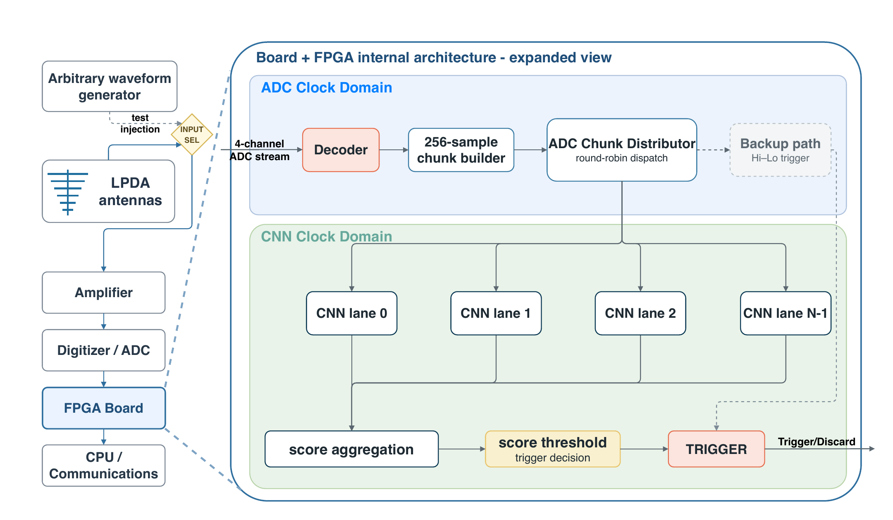
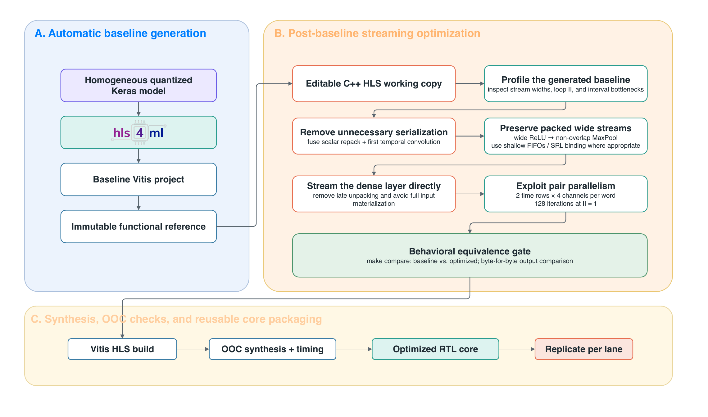

# AI-Trigger-System

[](LICENSE)

## Overview

This repository contains an FPGA AI trigger path for continuous radio detector
ADC data. The external interface is standardized on `CLK_ADC`, the 250 MHz
clock arriving from the frontend ADC side. Both input and event output are
synchronous to this clock. Each accepted beat carries eight channels with four
12-bit samples per channel, so the external data interface sustains
1 Gsps/channel without a source-side gearbox at the trigger-system boundary.
Internally, the stream is grouped into 256-sample CNN trigger chunks and the
leading four channels are distributed across five parallel CNN inference lanes.
The number of lanes is parameterized.

The CNN IP is provided by the `cnn-core` and `cnn-core-wrapper` Bender
dependencies.

## Design Figures

The current implementation follows the continuous lane-parallel trigger
architecture shown below.



The CNN core itself comes from the post-baseline streaming optimization flow:



## Dependency Management

This repository uses Bender to manage the external CNN RTL dependencies.

Install and update dependencies:

```bash
cargo install bender
bender update
```

Regenerate Vivado source scripts when dependencies change:

```bash
bender script vivado -t vivado > add_files.tcl
bender script vivado-sim -t sim > add_sim_files.tcl
```

If the generated Tcl files contain a hardcoded `ROOT`, update it for the local
checkout or regenerate the scripts on the target machine.

## DAQ Delivery Package

For first DAQ integration testing, generate a small release package instead of
sharing the full development repository:

```bash
python3 scripts/package_delivery.py --version v3.2.0-daq-test
```

The generated `dist/ai-trigger-daq-*.zip` contains the delivery README, all
required RTL, the OOC constraint file, a Vivado `add_files.tcl`, and version
metadata. `dist/` is generated output and is not committed.

## Current Architecture

Top-level hierarchy:

```text
AI_TRIGGER_TOP              HDL/rtl/AI_TRIGGER_TOP.vhd
  AI_TRIGGER_CORE           HDL/rtl/AI_TRIGGER_CORE.vhd
  AI_TRIGGER_PKG            HDL/rtl/AI_TRIGGER_PKG.vhd
  ADC_CHUNK_DISTRIBUTOR     HDL/rtl/ADC_CHUNK_DISTRIBUTOR.vhd
  CNN_CORE_LANE x 5         HDL/rtl/CNN_CORE_LANE.vhd
    xpm_fifo_async          256-bit write / 128-bit read lane FIFO
    WRAPPER_TOP             cnn-core-wrapper dependency
      cnn_core              cnn-core dependency
  EVENT_CAPTURE_PATH        HDL/rtl/EVENT_CAPTURE_PATH.vhd
    WAVEFORM_RING_BUFFER    HDL/rtl/WAVEFORM_RING_BUFFER.vhd
    TRIGGER_DECISION        HDL/rtl/TRIGGER_DECISION.vhd
    TRIGGER_CDC_FIFO        HDL/rtl/TRIGGER_CDC_FIFO.vhd
    EVENT_CAPTURE_CTRL      HDL/rtl/EVENT_CAPTURE_CTRL.vhd
    EVENT_OUTPUT_FIFO       HDL/rtl/EVENT_OUTPUT_FIFO.vhd
```

Functional data flow:

```text
DAQ ADC batches @ CLK_ADC
  -> DATA_STR + ADC_DATA[383:0]
     -> AI_TRIGGER_TOP flat-bus unpack
        -> AI_TRIGGER_CORE
           -> ADC_CHUNK_DISTRIBUTOR
              -> 256-timestep chunks, round-robin assigned to five CNN_CORE_LANE blocks
                 -> async FIFO + chunk-id CDC per lane
                    -> WRAPPER_TOP/cnn_core @ CLK_CNN
                       -> score + chunk id
                          -> threshold compare and event capture

The raw eight-channel ADC stream is also written into WAVEFORM_RING_BUFFER.
When a CNN score from channels 0-3 crosses CNN_THRESH, TRIGGER_DECISION sends
the trigger through TRIGGER_CDC_FIFO back to the ADC domain. TRIGGER_CDC_FIFO
keeps a 32-entry trigger descriptor queue in the CNN clock domain and uses an
XPM handshake CDC for the descriptor crossing. EVENT_CAPTURE_CTRL then reads
the corresponding triggered-chunk waveform window from the ring buffer and
writes all eight raw channels into EVENT_OUTPUT_FIFO. The DAQ-facing EVENT_*
ready/valid interface drains that FIFO.
```

The current trigger source is only the CNN trigger wrapper path. The event
waveform window is one chunk: the same 256-sample chunk whose CNN score crossed
`CNN_THRESH`, with no pre-trigger or post-trigger chunks. Each event therefore
emits 64 ADC-domain beats, with `EVENT_LAST` asserted on the final beat. A
24-bit chunk-index timestamp is carried with the triggered chunk to
`EVENT_TIMESTAMP` and remains unchanged on all 64 output beats.

### Clock Domains

| Clock | Nominal rate | Function |
| --- | ---: | --- |
| `CLK_ADC` | 250 MHz target | Frontend ADC clock used for both ADC ingest and event output. |
| `CLK_CNN` | 200 MHz | Streams data into the CNN wrappers, runs inference, and aggregates trigger results. |

The reset input `RST` is active high and may be driven by an upper-level DAQ or
global-control reset source. It is treated as an asynchronous assertion at the
AI trigger boundary, then released through local reset synchronizers in the
`CLK_ADC` and `CLK_CNN` domains before fanning out to domain logic. The
delivered OOC top has no extra source-clock or downstream-clock domain. The
input and event-output interfaces are synchronous to the same `CLK_ADC`; only
the internal `CLK_ADC` <-> `CLK_CNN` crossings should remain in the trigger
block. Reset must clear state machines, FIFO/ring pointers, metadata-valid
flags, and output-valid flags so reset release cannot create a false chunk or
false event.

### Event Timestamp

`EVENT_TIMESTAMP` is a 24-bit chunk-index timestamp in the trigger ingest
`CLK_ADC` domain. It increments once per accepted 256-sample chunk:

```text
1 timestamp tick = 64 accepted ADC beats = 256 samples/channel
```

The timestamp labels the 256-sample chunk, not the later event output time.
`CHUNK_ID` and `CHUNK_TIMESTAMP` advance at the same chunk cadence in the
current version, but their meanings stay separate: `CHUNK_ID` is the internal
ring-buffer and metadata matching tag, while `EVENT_TIMESTAMP` is the externally
visible chunk-index timestamp. When a chunk triggers, the trigger descriptor
carries the timestamp through the CNN-to-ADC trigger CDC FIFO, and the event
readout presents it unchanged on every beat of the corresponding event.

At the nominal 1 GSa/s source rate, the 24-bit timestamp wraps after about
4.29 s. Relative time comparisons should be performed modulo 24 bits.

### ADC Input Format

The DAQ-facing top exposes the eight-channel ADC input as a flat 384-bit
vector in the `CLK_ADC` domain:

```text
8 channels x 4 samples per ADC cycle x 12 bits = 384 bits
```

The top-level port and SystemVerilog testbench use a channel-major convention:

```text
ADC_DATA[(ch * 4 + sample) * 12 +: 12] <-> ADC_DATA4(ch)(sample)
```

The DAQ bring-up input is expected to come from the ADC12QJ1600 in signed
12-bit two's-complement format.  With the ADC default full-scale setting of
`V_FS = 0.8 Vpp` differential, the digital code maps to differential input
voltage as:

```text
Vdiff = signed_code * V_FS / 2^12
      = signed_code * 0.8 V / 4096
      = signed_code * 0.1953125 mV
```

Equivalently:

```text
signed_code = round(Vdiff / 0.1953125 mV)
```

The normal signed 12-bit range is `-2048..2047`, corresponding to about
`-400.0 mV..+399.8 mV` differential at `V_FS = 0.8 Vpp`.  Example codes:

| Differential input | Signed 12-bit code |
| ---: | ---: |
| 0 mV | 0 |
| +50 mV | about +256 |
| -50 mV | about -256 |
| +100 mV | about +512 |
| -100 mV | about -512 |

For DAQ bring-up, a zero-input test uses valid ADC beats with all signed codes
set to `0`.  A simple bipolar pulse test can use about `+50 mV / -50 mV`
differential samples, which maps to approximately `+256 / -256` ADC codes at
the default full-scale setting.

The CNN test vectors store one timestep as four packed 12-bit values.  The
Vivado testbench mirrors these four channels into input channels 4-7 so the
event payload is eight channels while CNN trigger decisions remain based on
channels 0-3:

```text
raw[11: 0] = ch0
raw[23:12] = ch1
raw[35:24] = ch2
raw[47:36] = ch3
raw[63:48] = unused
```

DAQ-side logic provides 12-bit signed two's-complement samples for all eight
channels in this packing. There is no external 16-bit sample container and no
low-bit zero padding at the trigger-system boundary. The distributor performs
the CNN-side fixed-point
conversion internally only for channels 0-3.  It converts each
`ap_fixed<12,6>`-style raw sample to the raw representation used by the CNN
input `ap_fixed<9,4>` lane: arithmetic right shift by one bit, saturate to the
9-bit raw range, then sign-extend into the 16-bit AXI-stream lane container
expected by the wrapper.  The 9-bit raw range is `-256..255`, which corresponds
to approximately `-8.0..7.96875` for `ap_fixed<9,4>`:

```text
axis_word[15: 0] = sign_extend(saturate(ch0[11:0] >>> 1, -256, 255))
axis_word[31:16] = sign_extend(saturate(ch1[11:0] >>> 1, -256, 255))
axis_word[47:32] = sign_extend(saturate(ch2[11:0] >>> 1, -256, 255))
axis_word[63:48] = sign_extend(saturate(ch3[11:0] >>> 1, -256, 255))
```

The saturation prevents fixed-point overflow wraparound.  Values already inside
the `ap_fixed<9,4>` raw range are unchanged; values above the range clamp to
`255`, and values below the range clamp to `-256`.

## Data Flow

`AI_TRIGGER_TOP` accepts `DATA_STR` and a flat 384-bit `ADC_DATA` bus directly
in the `CLK_ADC` domain. `DATA_STR` is a beat-valid signal: each accepted beat
contains four timesteps for all eight raw ADC channels, and continuous input can
hold `DATA_STR` high every `CLK_ADC` cycle. `ADC_CHUNK_DISTRIBUTOR` runs in this
same domain. A CNN chunk is 256 timesteps, so one chunk is complete after
64 accepted `DATA_STR` beats.

The input side has no `ADC_READY` backpressure signal. When `DATA_STR` is high,
the trigger system must synchronously accept the 384-bit ADC beat. If
`DATA_STR` is low, that cycle is not an accepted beat and does not advance the
chunk beat counter, chunk timestamp, waveform ring write pointer, or lane FIFO
write.

For every chunk:

1. The distributor selects a lane in round-robin order.
2. If the selected lane is available, all 64 ADC beats are written into that
   lane's async FIFO as CNN input words.
3. The normal design assumption is that round-robin lane assignment and CNN
   throughput keep the selected lane available. Internal overflow/status signals
   may be retained for simulation and debug, but they are not first-version
   delivered external ports.
4. The CNN side reads the FIFO as 128-bit words and emits 128 consecutive
   128-bit AXI-stream words to `WRAPPER_TOP`.

The first 250 MHz / 4-sample interface migration keeps the existing five CNN
lanes. These lanes are duplicate CNN processing resources for throughput, not
separate configuration domains. Round-robin assignment to fixed-latency,
matching CNN lanes is expected to preserve result order; `CHUNK_ID` remains in
the internal metadata path to check and match lane results, but the first
version does not add a complex reorder buffer.

The lane input FIFO crosses from `CLK_ADC` to `CLK_CNN`. Its write-side packing
must preserve chronological order while converting the four-sample external
beat stream into the 128 consecutive 128-bit AXI-stream words consumed by
`WRAPPER_TOP`. The ADC-domain aggregation should operate as a pipeline: it
should form CNN input write units as accepted beats arrive instead of waiting to
buffer a full 256-sample chunk before feeding the lane FIFO. Timestamp/chunk-id
alignment across this aggregation boundary is a required verification point.

`CNN_CORE_LANE` releases `CHUNK_BUSY` after the 128 input beats have been
accepted by the CNN input stream. It does not wait for the CNN score output.
This allows the input side of a lane to accept a later chunk while the previous
chunk is still propagating through the CNN pipeline.

The event readout path includes a synchronous `EVENT_OUTPUT_FIFO` in the
`CLK_ADC` domain. Its first-version depth target is 128 event beats, enough to
buffer two complete 64-beat triggered chunks during short downstream stalls.
`EVENT_CAPTURE_CTRL` writes raw waveform batches plus internal chunk id,
timestamp, and score into this FIFO. The delivered top exports only
`EVENT_VALID`, `EVENT_READY`, `EVENT_DATA`, `EVENT_LAST`, and
`EVENT_TIMESTAMP`; chunk id, score, overflow/status, and trigger debug pulses
remain internal/debug-only.

## Timing and Throughput

At 1 Gsps, one 256-sample chunk arrives every:

```text
256 samples / 1 GHz = 256 ns
```

With five lanes, each lane receives a new chunk every:

```text
5 x 256 ns = 1280 ns
```

The CNN wrapper 4.x single-core transaction interval is about 177-178 CNN clock
cycles in the wrapper/core reports. The minimum CNN clock to sustain the ADC
stream is therefore approximately:

```text
f_CNN >= CNN_interval_cycles / (N_LANES x 256 ns)
```

Using 178 cycles and 5 lanes:

```text
f_CNN >= 178 / 1280 ns = 139.1 MHz
```

Using the measured per-core latency of about 183 CNN cycles as a conservative
interval estimate:

```text
f_CNN >= 183 / 1280 ns = 143.0 MHz
```

The current 200 MHz CNN clock target leaves margin while matching the poster
architecture with five replicated cores.

The full-system behavioral check must be rerun after the 250 MHz, four-sample
per beat interface migration. The required validation point is `CLK_CNN =
200 MHz` with `CNN_THRESH_RAW = 0`, zero chunk overflows, zero dropped triggers,
zero ring misses, and one complete 64-beat event for every chunk whose
`score > CNN_THRESH`.

Measured latency should be reported end-to-end from the start of the ADC chunk
to `CNN_OUT_VALID`. It includes ADC batching, FIFO/CDC, CNN input streaming, CNN
pipeline latency, and output aggregation. It is not the steady-state output
interval. In steady state, accepted chunks are launched at the ADC chunk rate
across the five lanes. Keras comparison is used as a sanity check for score
alignment; exact score equality is not expected because the RTL is fixed-point
HLS output.

## Output Score and Trigger Threshold

`WRAPPER_TOP` returns the CNN score in a 32-bit output word for AXI-stream
byte alignment.  The numerical score is only the low 22 bits:

```text
CNN_OUT_DATA[31:22] = padding / not used by the comparator
CNN_OUT_DATA[21:0]  = signed ap_fixed<22,11> raw score
```

`ap_fixed<22,11>` has 22 total bits, 11 integer bits including the sign bit,
and 11 fractional bits.  The score is decoded using the same convention as the
wrapper reference testbench:

```text
score_float = signed(CNN_OUT_DATA[21:0]) / 2048.0
```

`AI_TRIGGER_CORE` compares the low 22 bits of each lane score against the low
22 bits of `CNN_THRESH` as signed `ap_fixed<22,11>` values:

```text
CNN_TRIG = 1 when signed(score[21:0]) > signed(CNN_THRESH[21:0])
```

From the host/software point of view, the hardware register or port to drive is
`CNN_THRESH[31:0]`, but the comparator only uses `CNN_THRESH[21:0]`.  Configure
it as a signed 22-bit raw fixed-point value:

```text
CNN_THRESH_raw = threshold_float * 2048
threshold_float = CNN_THRESH_raw / 2048
```

The representable threshold range is:

```text
CNN_THRESH_raw: [-2097152, 2097151]
threshold_float: [-1024.0, 1023.99951171875]
```

Common raw threshold values:

| Float threshold | Raw `CNN_THRESH` |
| ---: | ---: |
| -6.0 | -12288 |
| -0.5 | -1024 |
| 0.0 | 0 |
| 0.5 | 1024 |
| 1.0 | 2048 |

The default testbench and launcher configuration uses the current full-system
functional validation point: `SCORE_THRESHOLD=0.0` and `CNN_THRESH_RAW=0`.
The older wrapper-reference fallback threshold is still available by passing
`SCORE_THRESHOLD=-6.0` and `CNN_THRESH_RAW=-12288` explicitly.

`CNN_THRESH` is a single global threshold for the whole CNN trigger. It is not
per-channel, per-lane, or per-class. Although the threshold is consumed in the
`CLK_CNN` domain, the external configuration source may be driven from
`CLK_ADC` or from another DAQ/control clock, so the design must cross it through
an explicit configuration CDC path before CNN-domain comparison. The CNN-domain
control path latches a threshold snapshot when starting a 256-sample chunk, and
that snapshot is used for the full chunk decision.

## Output Interfaces

The event stream is a `CLK_ADC` ready/valid interface.  `EVENT_DATA` carries
eight-channel raw ADC waveform batches, not the CNN fixed-point converted
values.  Its bit packing matches the ADC batch packing:

```text
EVENT_DATA[(ch * 4 + sample) * 12 + 11 : (ch * 4 + sample) * 12]
  = raw 12-bit signed ADC sample for channel ch, sample index sample
```

For the current one-chunk event window, each event emits 64 `EVENT_VALID` beats.
`EVENT_TIMESTAMP` remains constant across those 64 beats, and `EVENT_LAST` is
asserted on the final beat. The delivered top does not expose CNN score, chunk
id, overflow counters, or trigger debug pulses.

## Main RTL Files

| File | Description |
| --- | --- |
| `HDL/rtl/AI_TRIGGER_PKG.vhd` | Shared constants and array types. `N_LANES` is currently 5. |
| `HDL/rtl/AI_TRIGGER_TOP.vhd` | DAQ-facing OOC top with flat ADC/event buses and timestamp-only event metadata. |
| `HDL/rtl/AI_TRIGGER_CORE.vhd` | Internal trigger core, result aggregation, and threshold comparison. |
| `HDL/rtl/ADC_INPUT_CDC_FIFO.vhd` | Simulation/helper CDC FIFO for source-clock test streams; not instantiated by the delivered OOC top. |
| `HDL/rtl/ADC_CHUNK_DISTRIBUTOR.vhd` | ADC-domain chunk formation and round-robin lane assignment. |
| `HDL/rtl/CNN_CORE_LANE.vhd` | Per-lane async FIFO, CDC counters, AXI-stream input FSM, and CNN wrapper instance. |
| `HDL/rtl/EVENT_CAPTURE_PATH.vhd` | Trigger decision, trigger CDC, waveform ring buffer, and event readout path. |
| `HDL/rtl/WAVEFORM_RING_BUFFER.vhd` | ADC-domain circular storage for recent raw waveform chunks. |
| `HDL/rtl/EVENT_CAPTURE_CTRL.vhd` | ADC-domain event window readout controller. |
| `HDL/rtl/EVENT_OUTPUT_FIFO.vhd` | Synchronous output FIFO that decouples event capture from short downstream stalls. |
| `HDL/sim/AI_TRIGGER_TOP_TB_WRAP.vhd` | Mixed-language simulation wrapper that models source-clock test input and instantiates `AI_TRIGGER_CORE`. |
| `HDL/sim/tb_ai_trigger_top.sv` | SystemVerilog simulation testbench. |
| `scripts/run_vivado_sim.py` | Batch-mode Vivado simulation launcher. |
| `run_sim.tcl` | Vivado simulation setup used by both GUI and batch flows. |

## Simulation

The recommended terminal flow for the current functional validation point is:

```bash
python3 scripts/run_vivado_sim.py \
  --num-samples 1000
```

The script opens `AI_Trigger_System/AI_Trigger_System.xpr`, sources
`run_sim.tcl`, and runs the behavioral xsim testbench in Vivado batch mode.

To reproduce the wrapper-reference fallback threshold instead:

```bash
python3 scripts/run_vivado_sim.py \
  --num-samples 1000 \
  --score-threshold -6.0 \
  --cnn-thresh-raw -12288
```

Vivado GUI flow:

```tcl
open_project AI_Trigger_System/AI_Trigger_System.xpr
source run_sim.tcl
```

The testbench reads `testhex_stream/test_input_sample*.hex` and
`testhex_stream/labels.hex`. `run_sim.tcl` creates a symlink to the
`cnn-core-wrapper` checkout's `testhex_stream` directory when the Bender
dependency is present.

Simulation output is written to:

```text
AI_Trigger_System/AI_Trigger_System.sim/sim_1/behav/xsim/ai_trigger_results.csv
```

Triggered waveform events are written to:

```text
AI_Trigger_System/AI_Trigger_System.sim/sim_1/behav/xsim/ai_trigger_events.csv
```

The event CSV includes `event_timestamp`, a 24-bit chunk timestamp that is
constant across all 64 beats of a triggered-chunk event.

After a full-system run, validate the score CSV, event CSV, and simulation log
with:

```bash
python3 scripts/analyze_vivado_sim_results.py \
  AI_Trigger_System/AI_Trigger_System.sim/sim_1/behav/xsim/ai_trigger_results.csv \
  --log AI_Trigger_System/AI_Trigger_System.sim/sim_1/behav/xsim/simulate.log \
  --event-csv AI_Trigger_System/AI_Trigger_System.sim/sim_1/behav/xsim/ai_trigger_events.csv \
  --expected-samples 1000 \
  --expected-cores 5 \
  --expected-cnn-mhz 200 \
  --expected-thresh-raw 0 \
  --max-overflows 0
```

At the current threshold-0 validation point, every `score > CNN_THRESH` chunk is
expected to produce exactly one 64-beat event. The post-migration run should
confirm there are no missing, duplicate, or extra event chunks.

## DAQ Bring-Up Score Simulation

For delivery bring-up, use the dedicated script to generate two simple
stimulus sets and run them through the same Vivado/xsim testbench:

```bash
python3 scripts/run_bringup_sim.py \
  --stimulus all \
  --out-dir build/bringup_sim
```

The script creates local `testhex_stream` directories, then launches
`scripts/run_vivado_sim.py` for each case.  It keeps the existing Bender/Vivado
source refresh path through `run_sim.tcl`, but supplies generated stimulus
instead of the wrapper validation dataset.

The generated bring-up cases are:

| Case | Input |
| --- | --- |
| `zero` | Valid continuous ADC input, all eight channels at signed code `0`. |
| `bipolar_sweep` | Only `ch0` is driven; `ch1..ch7` stay at `0`. A 15-sample pulse is swept across one 256-sample chunk. |

The default bipolar pulse is `+50 mV` for 5 ns, `0 mV` for 5 ns, then
`-50 mV` for 5 ns.  At 1 GSa/s and `V_FS = 0.8 Vpp`, this corresponds to:

```text
+256 ADC code for 5 samples
   0 ADC code for 5 samples
-256 ADC code for 5 samples
```

The pulse start offset is swept from sample `0` through sample `241`, so every
15-sample pulse remains inside one 256-sample CNN chunk.  The bring-up runner
passes `MIRROR_RAW_CHANNELS=0` to the testbench so raw event channels `ch1..ch7`
remain zero unless explicitly driven.

To generate stimulus files without launching Vivado:

```bash
python3 scripts/run_bringup_sim.py \
  --generate-only \
  --stimulus all \
  --out-dir build/bringup_sim
```

After Vivado completes, the runner writes annotated score CSVs:

```text
build/bringup_sim/zero/scores_annotated.csv
build/bringup_sim/bipolar_sweep/scores_annotated.csv
```

If Vivado was run manually and only raw `scores.csv` files are present, rebuild
the annotated CSVs with:

```bash
python3 scripts/run_bringup_sim.py \
  --annotate-only \
  --stimulus all \
  --out-dir build/bringup_sim
```

Plot the zero baseline and bipolar score distribution with:

```bash
python3 scripts/plot_bringup_scores.py \
  --out-dir build/bringup_sim
```

The plot script writes:

```text
build/bringup_sim/score_vs_offset.png
build/bringup_sim/score_histogram.png
build/bringup_sim/bringup_score_summary.csv
```

## Continuous Validation Plots

Full-dataset score validation plots are generated with PyROOT:

```bash
python3 analysis/Continuous/plot_continuous_validation.py
```

The script reads the Vivado simulation score CSV and the Keras comparison CSV,
then writes:

```text
analysis/Continuous/continuous_validation.root
analysis/Continuous/continuous_validation_report.pdf
```

The report includes score agreement, score residuals, absolute score error,
threshold-0 confusion matrices, latency, and score distributions by label.

## Synthesis and Implementation Notes

The current design is intended to be analyzed with Vivado synthesis and
implementation using the committed project:

```text
AI_Trigger_System/AI_Trigger_System.xpr
```

Primary checks for the next analysis step:

1. Confirm `CLK_CNN` timing closure at 200 MHz.
2. Confirm `CLK_ADC` timing closure at 250 MHz.
3. Review resource use for five CNN wrappers plus the event/lane FIFOs.
4. Check XPM/FIFO Generator resource mapping and reset behavior.
5. Review inter-clock timing constraints between `CLK_ADC` and `CLK_CNN`.

The recommended OOC build command is:

```bash
python3 scripts/run_vivado_build.py --impl
```

This flow uses Bender to collect RTL sources, removes dependency board-level
constraints, applies `HDL/constraints/ai_trigger_ooc.xdc`, and runs the block
out-of-context. This is intentional: `AI_TRIGGER_TOP` is a DAQ subsystem block,
not the package-level FPGA top. Running normal top-level implementation on this
entity would map the wide ADC/event interfaces to package IO and produce
misleading resource, timing, and IO utilization results.

OOC build reports are written under:

```text
build/vivado_ooc_ai_trigger/reports/
```

Post-implementation SAIF and timing reports are written under:

```text
build/vivado_post_impl_saif/reports/
```

The current checked-in OOC reports were refreshed on the server for the
250 MHz `CLK_ADC` interface. The routed result summary is:

| Metric | Current report |
| --- | ---: |
| Timing | WNS 1.085 ns, TNS 0, WHS 0.009 ns |
| `CLK_ADC` | 250 MHz target |
| `CLK_CNN` | 200 MHz target |
| CDC | Known OOC/input-port reset item plus recognized XPM/handshake crossings |
| CLB LUT | 28,864 |
| CLB registers | 18,847 |
| BRAM tiles | 26 |
| URAM | 6 |
| DSP | 20 |
| IOB | 0 |
| Vectorless power | 1.301 W total, Medium confidence |
| Dynamic power | 0.844 W |
| Static power | 0.458 W |

The hierarchical utilization report should show all five lanes present. Each
lane contains one CNN wrapper and one async FIFO, so the CNN datapath was not
optimized away in implementation.

The current vectorless hierarchy report shows dynamic power dominated by the five
CNN lanes. Each lane is about 0.151-0.155 W, including about 0.137-0.141 W in
the wrapper and about 0.010-0.012 W in the FIFO. The distributor is about
0.005 W.

The OOC build flow preserves the CNN wrapper/core hierarchy but intentionally
does not apply `DONT_TOUCH` to the per-lane FIFO Generator instances. Leaving
the lane FIFOs optimizable restored the 200 MHz `CLK_CNN` margin by allowing
Vivado to improve BRAM-heavy FIFO placement/routing.

The refreshed routed timing report confirms the two-clock OOC boundary:
`CLK_ADC` at 250 MHz and `CLK_CNN` at 200 MHz. The OOC constraints intentionally
use zero-delay IO boundary assumptions. Vivado reports 828 `XDCH-2` methodology
warnings because the OOC input/output delays use the same 0 ns min/max value on
wide ADC/event ports. This is expected for the current block-level report, but
the board-level integration must replace or justify these boundary assumptions
with system timing constraints.

The main throughput target is one 256-sample chunk every 256 ns at the ADC
input. At five lanes, the CNN domain should have enough margin if the single
core transaction interval remains near 177-178 cycles and the implemented
`CLK_CNN` frequency is at or above 200 MHz.

More detailed report interpretation and the current sign-off checklist are in
`docs/implementation.md`.

## Post-Implementation SAIF Power Flow

For power analysis, use a routed netlist simulation to collect switching
activity and feed the resulting SAIF back into `report_power`:

```bash
python3 scripts/run_post_impl_saif.py --samples 64
```

The run uses the flat-port simulation wrapper as the OOC top, runs the existing
testbench, starts SAIF recording after a 2 us warm-up window, writes
`build/vivado_post_impl_saif/activity/ai_trigger_post_impl.saif`, and reports
power to:

```text
build/vivado_post_impl_saif/reports/post_route_power_saif.rpt
```

The default gate simulation is functional, without SDF annotation, because the
SAIF goal is representative switching activity rather than exhaustive timing
simulation. For a short timing smoke test, reduce the sample count and enable
SDF:

```bash
python3 scripts/run_post_impl_saif.py --samples 16 --sdf max
```

Longer SAIF stimulus windows can be used when runtime is acceptable and a more
representative average activity profile is needed.
For faster debug runs, use `--saif-scope lane0`, `--saif-scope lanes2`, or
`--saif-scope lanes4`. The script prints object counts and elapsed time for
each SAIF logging chunk so long setup phases can be distinguished from a hang.
It also fails the run if fewer than 1000 simulation objects are logged, which
helps catch bad hierarchy patterns before producing a misleading power report.
The logged object count is determined by the xsim `get_objects` scope patterns,
not by timing constraints. The scope list is specified in
`scripts/vivado_post_impl_saif.tcl` so the intended SAIF coverage is explicit.
If scoped logging matches too few objects, the default flow falls back to a raw
full-DUT recursive `get_objects -r /tb_AI_TRIGGER_TOP/dut/*` pass and prints a
clear message before doing so. Use `--no-saif-fallback-all` to disable that
fallback during debugging.

The latest checked high-confidence SAIF report was a historical short smoke run
generated by this full-DUT fallback before the 250 MHz interface migration. The
scoped hierarchy patterns matched only the top-level DUT signals in xsim; the
fallback logged 136,469 objects and the power report matched 93% of design
nets. The report estimates 0.684 W total on-chip power, with 0.231 W dynamic
and 0.453 W static power. On the reference Ubuntu run, the full-DUT object
enumeration took about 68 minutes; the actual gate simulation completed in
about one minute. The detailed xsim trace is kept in
`build/vivado_post_impl_saif/xsim/xsim.log`.

High power confidence means Vivado received good switching activity coverage
for this workload window. It does not, by itself, prove that datapath logic was
preserved. Logic preservation is checked separately through hierarchical
utilization, timing, and simulation: the current reports still show all five
lanes, all five CNN wrappers, lane FIFOs, and 20 DSP blocks present.

The default SAIF wrapper now uses the same threshold-0 operating point as the
behavioral functional validation.  Pass explicit threshold arguments only when
you intentionally want a different activity profile:

```bash
python3 scripts/run_post_impl_saif.py \
  --samples 64
```
