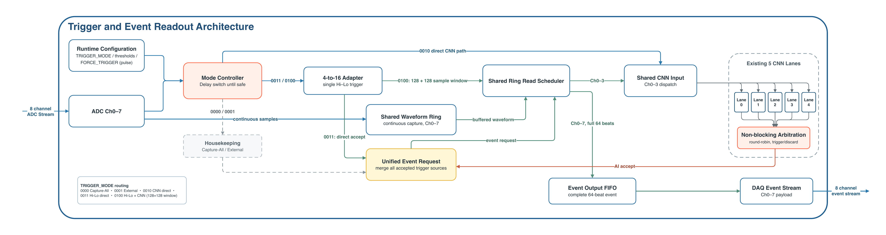

# AI-Trigger-System

[](LICENSE)

Runtime-selectable FPGA trigger and event readout for continuous radio-detector
ADC data. The DAQ input and event output run at 250 MHz with four samples per
cycle, giving 1 Gsps per channel.

Channels 0-3 feed the trigger algorithms. Every accepted event records channels
0-7. One bitstream supports housekeeping, AI, Hi-Lo, and Hi-Lo-gated AI modes.

## Architecture



Editable source: [`pic/trigger_system_architecture.drawio`](pic/trigger_system_architecture.drawio)
and [`trigger_system_architecture.drawio.pdf`](pic/trigger_system_architecture.drawio.pdf).

The raw eight-channel stream always advances one shared 64-chunk waveform ring.
Only the active trigger path creates work. The event recorder, output FIFO, ring,
two CNN lanes, and Hi-Lo engine are shared across modes.

```text
AI_TRIGGER_TOP
  AI_TRIGGER_CORE
    ADC_CHUNK_DISTRIBUTOR          continuous AI input
    CNN_CORE_LANE x 5              shared CNN inference lanes
    CNN_RESULT_ARBITER
    MULTIMODE_EVENT_PATH
      TRIGGER_MODE_CTRL            safe runtime switching
      HOUSEKEEPING_TRIGGER_CTRL    Capture-All and External
      HILO_INPUT_ADAPTER
      HILO_TRIGGER_CTRL            Bender-managed PRE_TRIGGER wrapper
      GATED_CNN_READER             centered ring window to a free CNN lane
      WAVEFORM_RING_BUFFER         64 chunks, eight raw channels
      RING_READ_ARBITER
      EVENT_RECORDER
      EVENT_OUTPUT_FIFO
```

### Trigger modes

| `TRIGGER_MODE` | Mode | Event rule |
| --- | --- | --- |
| `0000` | Capture-All | Every complete 256-sample chunk becomes an event. |
| `0001` | External | A rearmed `FORCE_TRIGGER` rising edge selects one centered event. |
| `0010` | AI | Every chunk is evaluated by the CNN; `score > CNN_THRESH` triggers. |
| `0011` | Hi-Lo | A Hi-Lo decision selects one centered event. |
| `0100` | Hi-Lo + AI | Hi-Lo selects a centered ring window; the shared CNN makes the final decision. |

Values `0101` through `1111` fail closed. After reset the active mode is
`1111`; the first valid request applies after the first complete ADC chunk.

A runtime change stops new work at a chunk boundary and waits for the current
CNN, CDC, recorder, and output state to drain. The latest requested mode wins;
intermediate requests are not queued.

### Clocks and event timing

| Clock | Rate | Use |
| --- | ---: | --- |
| `CLK_ADC` | 250 MHz | ADC ingest, ring, Hi-Lo, event recorder, output |
| `CLK_CNN` | 200 MHz | CNN input streams and inference |

`RST` asserts high. It is synchronized locally on release in both clock
domains.

`EVENT_TIMESTAMP[23:0]` counts accepted 256-sample chunks. One tick is 64 ADC
beats. `EVENT_TRIGGER_OFFSET[5:0]` identifies the anchor beat inside the chunk.
The absolute anchor beat is:

```text
EVENT_TIMESTAMP * 64 + EVENT_TRIGGER_OFFSET
```

Capture-All and continuous AI use offset zero. External and Hi-Lo modes retain
their accepted trigger anchor.

## Interfaces

Bit ranges below use `[MSB:LSB]` notation.

### ADC input

`ADC_DATA[383:0]` carries eight channels, four signed 12-bit samples per channel:

```text
ADC_DATA[(ch * 4 + sample) * 12 +: 12] = ADC_DATA4(ch)(sample)
```

`DATA_STR` is the beat-valid signal. There is no ADC backpressure port; every
beat with `DATA_STR=1` is accepted.

The CNN uses channels 0-3 at the existing model scale `raw/64`. Conversion to
native `ap_fixed<10,5,AP_RND,AP_SAT_SYM>` is
`q = clamp(floor((raw + 1)/2), -511, 511)`, sign-extended into each 16-bit slot.
Two chronological ADC writes form a 512-bit native beat. The event path keeps
the original 12-bit samples.

### Configuration

| Input | Meaning |
| --- | --- |
| `TRIGGER_MODE[3:0]` | Requested runtime mode |
| `FORCE_TRIGGER` | External housekeeping trigger pulse |
| `CNN_THRESH[31:0]` | Stable signed 32-bit threshold word, unit 1/16 (step 0.0625) |
| `HL_THRESH[11:0]` | Non-negative Hi-Lo threshold in raw ADC codes |
| `HILO_WINDOW[7:0]` | Hi-Lo high/low window, 0–255 accepted samples |
| `COINC_WINDOW[7:0]` | Cross-channel coincidence window, 0–255 accepted samples |
| `BIN_THR[3:0]` | Required channel multiplicity, valid range 1-4 |

CNN scores retain native `ap_fixed<21,12>`; the external threshold format is
independent of the IP:

```text
score_float = signed(score[20:0]) / 512
threshold_float = signed(CNN_THRESH[31:0]) / 16
CNN_THRESH_raw = threshold_float * 16
```

Configuration is sampled with the work item so one inference uses one stable
threshold. Hi-Lo configuration is latched at safe Hi-Lo mode entry.
Both window inputs are now 8 bits and are no longer silently clamped to 16/32.
The canonical Hi-Lo core still consumes 16 samples, assembled from four accepted
ADC beats; aggregate order, fourth-beat anchor, result latency and the 256-sample
event size are unchanged. Strobe gaps do not consume window samples. The existing
AI wrapper configuration checks and blanking/busy/loss policy remain unchanged;
in particular, AI still rejects `BIN_THR=0`, while the standalone dependency's
original `BIN_THR=0` behavior is preserved.
The comparison remains strictly greater than, with full-width handling of
negative and out-of-native-range thresholds. See
[CNNThresholdInterface.md](docs/CNNThresholdInterface.md) for the fixed contract
and migration examples; threshold 2.0 is now the external word 32.

### Event output

The event output is a `CLK_ADC` ready/valid stream. Each event is exactly 64
beats and contains 256 samples from channels 0-7.

```text
EVENT_DATA[(ch * 4 + sample) * 12 +: 12] = raw 12-bit sample
```

`EVENT_TIMESTAMP` and `EVENT_TRIGGER_OFFSET` remain stable for all 64 beats.
`EVENT_LAST` is high on the final beat. The output FIFO holds two complete
events and only starts a new event when one full-event credit is available.

Status outputs report the active mode, pending mode switch, invalid mode,
Hi-Lo rate blanking, invalid Hi-Lo configuration, and sticky event loss.

## Source layout

| Path | Contents |
| --- | --- |
| `HDL/rtl/` | OOC top, multimode control, ring/event path, CDC, CNN lanes |
| `HDL/sim/` | Mixed-language full-system simulation wrapper and testbench |
| `HDL/constraints/` | OOC timing and CDC constraints |
| `scripts/` | Vivado launchers, analyzers, report and waveform tools |
| `tests/` | GHDL and Python regression tests |
| `docs/` | DAQ delivery interface and implementation notes |
| `build/multimode_trigger_validation/` | Tracked multimode validation report and raw artifacts |
| `build/vivado_ooc_ai_trigger/` | Tracked OOC checkpoints and Vivado reports |

Main integration files:

| File | Role |
| --- | --- |
| `HDL/rtl/AI_TRIGGER_TOP.vhd` | DAQ-facing OOC boundary |
| `HDL/rtl/AI_TRIGGER_CORE.vhd` | CNN cluster and multimode integration |
| `HDL/rtl/MULTIMODE_EVENT_PATH.vhd` | Shared mode, ring, trigger, and event path |
| `HDL/rtl/TRIGGER_MODE_CTRL.vhd` | Safe runtime mode switching |
| `HDL/rtl/HILO_TRIGGER_CTRL.vhd` | Hi-Lo wrapper, rate protection, request generation |
| `HDL/rtl/GATED_CNN_READER.vhd` | Hi-Lo-centered waveform replay into CNN |
| `HDL/rtl/WAVEFORM_RING_BUFFER.vhd` | Shared eight-channel history |
| `HDL/rtl/EVENT_RECORDER.vhd` | Complete-event ring readout |
| `HDL/rtl/CNN_CORE_LANE.vhd` | Per-lane CDC and CNN stream control |

## Dependencies

Bender pins the native wrapper at `a82a717403c8346d027f62b017295d8ea6fa3344`
and CNN Core at `eca9b12f9f49f4b7324ed9ed241a44086ca9c842`, with Hi-Lo Trigger
v3.0.0 (`047d14a25ca0df95d2219eded90e0b449574ae15`). Each of the two lanes sends 32 native 512-bit beats per window; the
wrapper passes native control and scores through unchanged. The system owns
ADC conversion, FIFO width conversion, work metadata, and scheduling.

```bash
cargo install bender
bender checkout
```

Vivado launchers regenerate their source list from the Bender graph. Do not add
a parallel manual source list.
The Hi-Lo upgrade uses the exact semantic-version requirement `=3.0.0` and the
scoped `bender update hilo-trigger --fetch`; it does not update CNN dependencies.

A normal checkout resolves the exact Git pins without local overrides. If using
`Bender.local` during development, verify the resolved source hashes; an override
can change compiled code independently of the published pins.

## Native CNN validation

See the [Hi-Lo v3 integration qualification](docs/qualification/hilo_v3_20260919/README.md)
for the current two-lane implementation, source audit and reproduction commands.
The [stable threshold qualification](docs/qualification/stable_cnn_threshold_20260918/README.md)
is the pre-upgrade comparison baseline.
The earlier integration results remain in [NativeCNNQualification.md](docs/NativeCNNQualification.md).

All nine actual-IP scenarios pass, including 1096 exact-score windows and 475
complete eight-channel events at threshold zero, plus positive, negative and
extreme external thresholds. Routed OOC meets 250/200 MHz with ADC/CNN setup
WNS +0.311/+0.180 ns and overall WHS +0.007 ns, zero DRC errors and zero unsafe
or unknown CDC endpoints. Relative to the pre-upgrade baseline, LUT/FF grow
by 0.269%/0.090%, with no added DSP/BRAM/URAM. The accepted minimum setup margin
is 0.0 ns. This is block-level qualification, not gateware or board validation.

## Historical validation (previous CNN)

The following plots, scores, and counts are retained for historical comparison;
they do not describe the native CNN.

The complete report, raw CSVs, XSim logs, centered waveform arrays, and machine
summaries are in
[`build/multimode_trigger_validation/REPORT.md`](build/multimode_trigger_validation/REPORT.md).

### Five-mode simulation

All modes used the same 1000-chunk dataset with 180 signal labels. CNN threshold
was zero. The baseline Hi-Lo configuration used raw threshold 192,
`HILO_WINDOW=5`, `COINC_WINDOW=32`, and `BIN_THR=2`.

| Mode | Events | CNN evaluations | TP / FP | Accuracy | Recall | Result |
| --- | ---: | ---: | ---: | ---: | ---: | --- |
| `0000` | 1000 | 0 | - | - | - | Exact Capture-All contract |
| `0001` | 250 | 0 | - | - | - | Exact interval-4 external contract |
| `0010` | 162 | 1000 | 162 / 0 | 98.2% | 90.0% | No overflow, drop, or event loss |
| `0011` | 24 | 0 | 19 / 5 | 83.4% | 10.6% | Rate blanking and event loss observed |
| `0100` | 0 | 24 | 0 / 0 | 82.0% | 0% | All gated CNN scores were below zero |

Recall is `TP / (TP + FN)`. The 82% result in mode `0100` is only the
all-background baseline from 820 negative labels.

The mode-`0010` score stream was also compared with the Bender-locked standalone
CNN wrapper. All 1000 rows matched exactly in sample ID, raw score bits, decoded
score, and prediction. The 18 false negatives are not a multimode alignment
error.

### Hi-Lo thresholds and gated CNN windows

The reference analysis uses background `RMS = std(X_test[label=0]) = 1.020686`.
One RMS is 65.3239 raw ADC codes, so raw 192 is 2.939 RMS. The requested 3.4 and
4 RMS points use raw 222 and 261.

| Hi-Lo threshold | Mode `0011` events | Mode `0100` CNN runs | Mode `0100` events | Blanking |
| --- | ---: | ---: | ---: | ---: |
| 2.939 RMS / raw 192 | 24 | 24 | 0 | Yes |
| 3.398 RMS / raw 222 | 11 | 11 | 0 | Yes |
| 3.995 RMS / raw 261 | 19 | 19 | 0 | No |

The non-monotonic final event count is caused by rate blanking and busy-path
loss. The independent Hi-Lo candidate count remains monotonic: 133, 51, and 20.

The following plot shows the 24 raw-192 windows sent to the gated CNN. Samples
are converted exactly like the RTL and normalized by background RMS. The gray
band is the 16-sample Hi-Lo decision group; the dashed line is the centered
boundary.


Plots for 3.4 and 4 RMS are included in the full report.

### Historical OOC implementation (superseded CNN)

The figures below describe the previous five-lane system, not native two-lane
qualification. Current evidence is recorded in
`docs/qualification/hilo_v3_20260919/README.md`.

The Wrapper v5.0.0 and CNN Core v4.1.0 OOC run closes timing at
`CLK_ADC=250 MHz` and `CLK_CNN=200 MHz` with no routing errors.

| Metric | Result |
| --- | ---: |
| WNS / TNS | 0.039 ns / 0 ns |
| WHS / THS | 0.029 ns / 0 ns |
| CLB LUTs | 37,207 (17.15%) |
| CLB registers | 33,406 (7.70%) |
| BRAM tiles | 33.5 (6.98%) |
| URAM | 6 (9.38%) |
| DSP | 200 (10.96%) |
| Vectorless power | 2.315 W (medium confidence) |

The tracked
[`build/vivado_ooc_ai_trigger/reports/`](build/vivado_ooc_ai_trigger/reports/)
directory contains the timing, utilization, CDC, methodology, and power output
from this implementation run.

## Build and test

Run local regressions:

```bash
python3 -m unittest discover -s tests
python3 scripts/run_ghdl_tests.py
```

Build the ADC-aware reference and run the actual-IP/XPM suite using the commands
in [NativeCNNQualification.md](docs/NativeCNNQualification.md). Once the reference
exists, the complete suite is:

```bash
python3 scripts/run_native_qualification.py \
  --reference build/native_reference \
  --output build/native_qualification \
  --vivado /tools/Xilinx/Vivado/2023.2/bin/vivado
```

The older `run_vivado_sim.py`, dataset sweeps and pulse plots remain useful for
historical experiments; their default test-data directories are not the new
native qualification corpus.

Run OOC synthesis and implementation:

```bash
python3 scripts/run_vivado_build.py \
  --vivado /tools/Xilinx/Vivado/2023.2/bin/vivado \
  --bender /home/work1/.cargo/bin/bender \
  --impl
```

The OOC flow uses Bender for source order, applies
`HDL/constraints/ai_trigger_ooc.xdc`, and does not map the wide DAQ ports to
package pins.

Run the focused NSF continuous-readout check:

```bash
python3 scripts/run_nsf_jul_27_sim.py
```

Generate or analyze DAQ bring-up pulse sweeps:

```bash
scripts/run_bringup_pulse_sweeps.sh
python3 scripts/plot_bringup_scores.py --out-dir build/bringup_sim
```

The older `run_post_impl_saif.py` flow is retained as historical tooling. It
has not been qualified for this native two-lane delivery; no activity-based
power result is claimed here.

## Delivery

DAQ-facing port definitions and basic test guidance are in
[`docs/Deliverables.md`](docs/Deliverables.md). Generate a compact delivery
archive with:

```bash
python3 scripts/package_delivery.py --version stable-threshold
```

`dist/` is generated output and is not committed.
