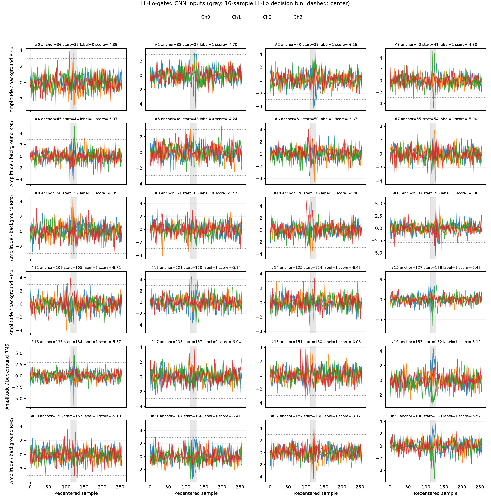
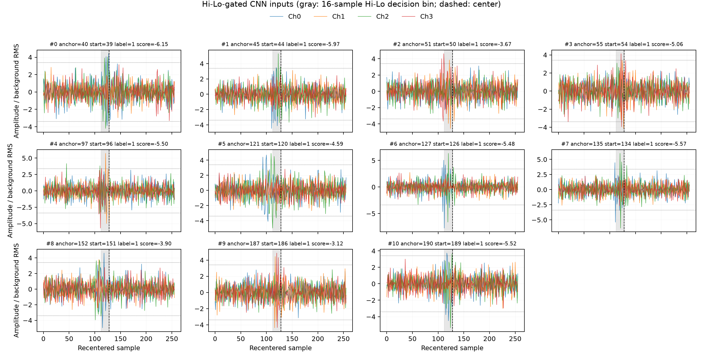
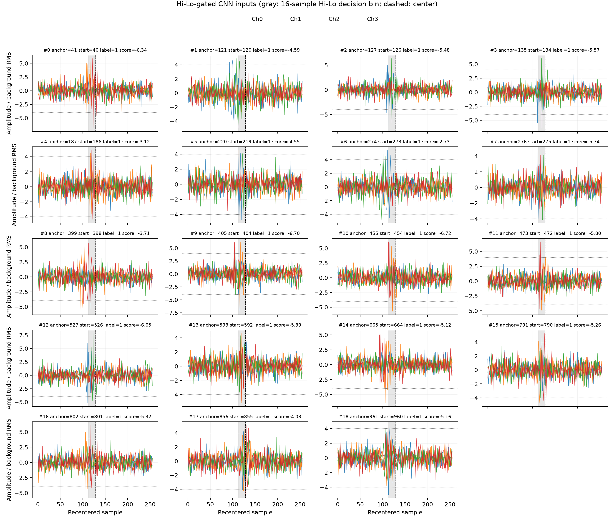

# Multimode Trigger Validation

This report records the multimode RTL validation completed at RTL commit
`63477cd`. Commit `2d94076` added the waveform reconstruction tool without
changing RTL.

## Scope

The same bitstream supports five runtime trigger modes. Channels 0-3 feed the
trigger algorithms. Every accepted event records channels 0-7 as one 256-sample,
64-beat event.

| Mode | Function | Decision path |
| --- | --- | --- |
| `0000` | Capture-All | Record every complete chunk. |
| `0001` | External | Record only on a `FORCE_TRIGGER` pulse. |
| `0010` | AI | Run every chunk through the five shared CNN lanes. |
| `0011` | Hi-Lo | A Hi-Lo decision creates the event request. |
| `0100` | Hi-Lo + AI | Hi-Lo selects a centered ring window; the shared CNN makes the final decision. |

Mode changes apply only at a safe chunk boundary. The latest requested mode
wins while the current path drains. The waveform ring, event recorder, output
FIFO, CNN lanes, and Hi-Lo engine are shared rather than duplicated per mode.

## Test configuration

| Item | Value |
| --- | ---: |
| Dataset | 1000 chunks |
| Signal labels | 180 |
| Background labels | 820 |
| CNN score threshold | 0 |
| Hi-Lo threshold | raw 192 |
| `HILO_WINDOW` | 5 |
| `COINC_WINDOW` | 32 |
| `BIN_THR` | 2 |
| External trigger interval | 4 chunks |

The Vivado/XSim runs used the CNN and Hi-Lo sources resolved by Bender. Raw
outputs are under [`mode_sweep/`](mode_sweep/), and the analyzer output is
[`mode_sweep/summary.json`](mode_sweep/summary.json).

## Five-mode result

| Mode | Events | CNN evaluations | TP | FP | Accuracy | Recall | Status |
| --- | ---: | ---: | ---: | ---: | ---: | ---: | --- |
| `0000` | 1000 | 0 | - | - | - | - | Exact Capture-All contract |
| `0001` | 250 | 0 | - | - | - | - | Exact interval-4 external contract |
| `0010` | 162 | 1000 | 162 | 0 | 98.2% | 90.0% | No overflow, drop, or event loss |
| `0011` | 24 | 0 | 19 | 5 | 83.4% | 10.6% | Rate blanking and event loss observed |
| `0100` | 0 | 24 | 0 | 0 | 82.0% | 0% | All 24 gated CNN scores were below zero |

Recall is `TP / (TP + FN)`. The 82% result in mode `0100` is the all-background
baseline from 820 negative labels; it is not useful trigger performance.

The independent fixed-chunk Hi-Lo software reference produced 133 candidates
at raw threshold 192. The integrated modes accepted only 24 because the
continuous path also applies busy handling and rate blanking.

## Hi-Lo threshold and centered windows

The reference Hi-Lo analysis defines background RMS as:

```text
noise_rms = std(X_test[label == 0]) = 1.020686
1 RMS = 64 * noise_rms = 65.3239 raw ADC codes
```

Therefore raw threshold 192 is 2.939 RMS, not exactly 3 RMS. The requested
thresholds map to raw 222 (3.398 RMS) and raw 261 (3.995 RMS).

| Threshold | Mode | Reference candidates | CNN evaluations | Events | TP / FP | Recall | Blanking / dropped |
| --- | --- | ---: | ---: | ---: | ---: | ---: | ---: |
| 2.939 RMS | `0011` | 133 | 0 | 24 | 19 / 5 | 10.6% | 1 / 59 |
| 2.939 RMS | `0100` | 133 | 24 | 0 | 0 / 0 | 0% | 1 / 59 |
| 3.398 RMS | `0011` | 51 | 0 | 11 | 11 / 0 | 6.1% | 1 / 27 |
| 3.398 RMS | `0100` | 51 | 11 | 0 | 0 / 0 | 0% | 1 / 27 |
| 3.995 RMS | `0011` | 20 | 0 | 19 | 19 / 0 | 10.6% | 0 / 35 |
| 3.995 RMS | `0100` | 20 | 19 | 0 | 0 / 0 | 0% | 0 / 35 |

The reference candidate count falls monotonically from 133 to 51 to 20. The
final RTL event count does not because the 3.398 RMS run entered rate blanking
while the 3.995 RMS run did not. These final event counts are therefore not a
clean threshold ROC.

The plots below reconstruct the exact 64-beat windows selected from the ring,
apply the same input quantization and saturation as `adc_to_axis16`, and divide
the amplitude by background RMS. The gray band is the 16-sample Hi-Lo decision
group. The dashed line is the centered boundary after that group.

### Raw 192 / 2.939 RMS



### Raw 222 / 3.398 RMS



### Raw 261 / 3.995 RMS



Each plot directory also contains the reconstructed NumPy array, metadata CSV,
and a JSON summary.

## CNN alignment check

Mode `0010` was compared against the Bender-locked standalone
`cnn-core-wrapper` using the same 1000 test vectors. The comparison covered
`sample_id`, raw output bits, decoded score, and prediction.

| Check | Result |
| --- | ---: |
| Standalone rows | 1000 |
| System rows | 1000 |
| Mismatched rows | 0 |
| Accuracy | 98.2% |
| False positives | 0 |
| False negatives | 18 |

The continuous-AI accuracy is not reduced by multimode chunk alignment. The
system score stream is bit-exact with the standalone fixed-point wrapper. A
fresh floating-point Keras comparison was not run because TensorFlow was not
installed on the validation server.

## OOC implementation

The final OOC implementation used `CLK_ADC=250 MHz` and `CLK_CNN=200 MHz`.
Timing closed without setup, hold, or pulse-width violations.

| Metric | Result |
| --- | ---: |
| WNS / TNS | 0.322 ns / 0 ns |
| WHS / THS | 0.024 ns / 0 ns |
| WPWS / TPWS | 1.300 ns / 0 ns |
| CLB LUTs | 32,061 |
| CLB registers | 20,311 |
| BRAM tiles | 26 |
| URAM | 6 |
| DSP | 20 |
| Vectorless power | 1.264 W |

The complete reports and checkpoints are under
[`../vivado_ooc_ai_trigger/`](../vivado_ooc_ai_trigger/). The routed timing
source is
[`post_route_timing_summary.rpt`](../vivado_ooc_ai_trigger/reports/post_route_timing_summary.rpt).

## Reproduce

Run local RTL tests:

```bash
python3 scripts/run_ghdl_tests.py
python3 -m unittest discover -s tests
```

Run the five-mode Vivado sweep on a machine with Vivado:

```bash
python3 scripts/run_trigger_mode_sweep.py \
  --vivado /tools/Xilinx/Vivado/2023.2/bin/vivado \
  --output-dir build/multimode_trigger_validation/mode_sweep \
  --hl-thresh 192 \
  --hilo-window 5 \
  --coinc-window 32 \
  --bin-thr 2
```

Rebuild a centered-waveform plot from a completed Hi-Lo and Hi-Lo+AI pair:

```bash
python3 scripts/plot_hilo_gated_waveforms.py \
  --x-npy data/X_test_data.npy \
  --labels-npy data/y_test_labels.npy \
  --events-csv build/multimode_trigger_validation/mode_sweep/mode_0011/events.csv \
  --scores-csv build/multimode_trigger_validation/mode_sweep/mode_0100/scores.csv \
  --hl-thresh-raw 192 \
  --output-dir build/multimode_trigger_validation/threshold_192/plot
```

## Machine-readable summaries

- [`mode_summary.csv`](mode_summary.csv)
- [`threshold_sweep_summary.csv`](threshold_sweep_summary.csv)
- [`cnn_alignment.json`](cnn_alignment.json)
- [`ooc_summary.json`](ooc_summary.json)
